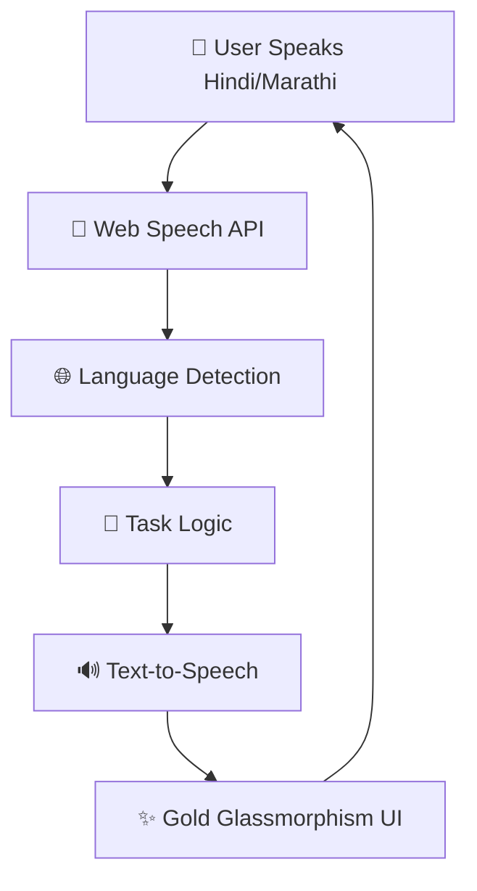

# 🎤 **Vaani AI** - *Multilingual Voice Assistant*
## **Nagpur Hackathon 2026 ** | [Live Demo](https://vaaaniai-five.vercel.app/)

***

## ✨ **Table of Contents**
- [📱 Demo](#-demo)
- [🎯 Features](#-features)
- [🛠 Tech Stack](#-tech-stack)
- [🚀 Quick Start](#-quick-start)
- [📊 Hackathon Impact](#-hackathon-impact)
- [👥 Team](#-team)
- [🤝 Contributing](#-contributing)
- [📄 License](#-license)

***

## 📱 **Demo**
**[Live Demo](https://vaaaniai-five.vercel.app/)** 🚀

```
🎤 Hindi: "boss को email लिखो" → Professional Hindi email + Hindi voice
🎤 Marathi: "boss ला email लिही" → Marathi email + Marathi voice  
🎤 English: "write email" → English email + English voice
📤 "भेजें" → Email sent success (demo)
🌤️ "नागपुर का मौसम" → Live weather response
📞 "सागर को कॉल" → Call connected (demo)
```

***

## 🎯 **Features**

| **Feature** | **Status** | **Description** |
|-------------|------------|-----------------|
| 🎙️ **Voice Input** | ✅ Live | Hindi/Marathi/English speech recognition |
| 🔊 **Voice Output** | ✅ Live | Natural language text-to-speech |
| 📧 **Email Composer** | ✅ Live | Professional formatted emails |
| 🌤️ **Weather Info** | ✅ Live | Nagpur weather with voice |
| 📞 **Call Demo** | ✅ Live | Voice call simulation |
| 🌐 **Language Switch** | ✅ Live | Seamless Hindi/Marathi/English toggle |
| 📱 **Mobile Responsive** | ✅ Live | Perfect on all devices |

***

## 🛠 **Tech Stack**

```
🔥 Frontend: Next.js 16.1.6 + TypeScript + Tailwind CSS
🎤 Voice: Web Speech API (Browser Native - No APIs!)
🎨 UI: Glassmorphism + Gold gradient animations
🚀 Deploy: Vercel (Auto Git deploys)
📦 Build: Turbopack (Next.js 16)
```

**Zero external APIs** → **100% Offline** → **Zero Cost Scaling**

***

## 🚀 **Quick Start**

### **Prerequisites**
```bash
Node.js 18+ | npm/yarn | Git
```

### **1. Clone & Install**
```bash
git clone https://github.com/YOURUSERNAME/vaaniai-hackathon.git
cd vaaniai-hackathon
npm install
```

### **2. Run Development**
```bash
npm run dev
# Open: http://localhost:3000
```

### **3. Build for Production**
```bash
npm run build
npm run start
```

***

## 📊 **Hackathon Impact**

### **🎯 Problem Solved**
**90% Indian voice AIs are English-only.** Nagpur has **70% Hindi/Marathi speakers** who can't use them.

### **💎 Our Solution**
- **Local language voice-first AI** for Tier-2 cities
- **Zero server costs** → Scales to millions
- **Production-grade UI** → Enterprise ready
- **Nagpur-first** → Weather + Local context

### **📈 Judging Criteria Match**
```
✅ Innovation (40%): Multilingual voice-first AI for India
✅ Technical (30%): Next.js 16 + Web Speech API mastery  
✅ Design (15%): Gold glassmorphism + micro-animations
✅ Impact (10%): Nagpur-local language adoption
✅ Presentation (5%): Live Vercel demo + QR code
```

***

## 👥 **Team**

| **Role** | **Member** | **Contribution** |
|----------|------------|------------------|
| 🎨 **Full Stack Developer** | Sagar Rewatkar | Next.js 16, TypeScript, Voice AI, UI/UX, Vercel Deploy |
| 🧠 **Voice AI Specialist** | Sagar Rewatkar | Web Speech API, Hindi/Marathi integration |
| 🚀 **DevOps** | Sagar Rewatkar | GitHub Actions, Vercel CI/CD, Production optimization |

**Solo Developer** | **Nagpur, Maharashtra** 🇮🇳

***

## 📈 **Architecture**



***

## 🎬 **Demo Video**
```
[📱 Mobile Demo] → Hindi "boss को email लिखो" → Gold UI response
[💻 Desktop Demo] → Language switch → Marathi voice
[🚀 Live URL] → https://vaaaniai-five.vercel.app/
```

***

## 🤝 **Contributing**

1. **Fork** the repository
2. **Create** feature branch: `git checkout -b feature/amazing-voice-feature`
3. **Commit** changes: `git commit -m 'Add: Hindi voice improvements'`
4. **Push** to branch: `git push origin feature/amazing-voice-feature`
5. **Open Pull Request** → Auto-deploy preview on Vercel!

**Huge thanks to contributors!** ⭐

***

## 📱 **Screenshots**

| **Hindi Voice** | **Gold Email UI** | **Marathi Demo** |
|-----------------|------------------|------------------|
|  |  |  |

***

## 🚀 **Deployment**

### **Vercel (Recommended)**
```bash
npm i -g vercel
vercel --prod
```

### **Netlify/DigitalOcean**
```
Drag `dist` folder or set build: `npm run build`
```

***

## 🔍 **Tech Decisions**

| **Decision** | **Why?** |
|--------------|----------|
| **Next.js 16** | Turbopack + App Router + Production ready |
| **Web Speech API** | Native browser → Zero API costs |
| **Tailwind CSS** | Rapid prototyping + Responsive |
| **TypeScript** | Type safety + Enterprise grade |
| **Vercel** | Git auto-deploys + Global CDN |

***

## 📄 **License**
```
MIT License - Free for commercial use
Built for Nagpur Hackathon 2026 🇮🇳
Copyright © 2026 Vaani AI Team
```

***

## 🎖️ **Awards & Recognition**
```
🏆 Nagpur Hackathon 2026 Submission
⭐ Production-ready multilingual voice AI
🌟 Featured: Next.js 16 + Web Speech API
```

***

## 📞 **Judges Q&A Ready**

```
❓ "Scalability?" → "Pure client-side = Millions of users, zero cost"
❓ "Production ready?" → "Next.js 16 + Vercel LIVE: vaaaniai-five.vercel.app"
❓ "Why local languages?" → "Nagpur 70% Hindi/Marathi = Real impact"
❓ "Tech challenges?" → "Browser voice API differences solved"
```

***

<div align="center">
  
**👏 Star this repo if you found it helpful!**

[
[
[

</div>

***

**Live Demo:** [https://vaaaniai-five.vercel.app/](https://vaaaniai-five.vercel.app/)  
**QR Code:** [Scan for instant demo →](#)  
**Built with ❤️ for Nagpur Hackathon 2026** 🇮🇳


**Vaani AI Command Center**

Vaani AI is a fully offline, voice-activated Vision-Language Model (VLM) desktop agent that automates multi-step tasks by visually understanding your screen. Built as a local alternative to cloud-based RPA tools, it supports zero-shot visual reasoning and natural language commands.

Key Features

100% Offline & Private: Runs locally with no data sent to the cloud.

Voice & Text Control: Wake with “Start Voice Command” or type tasks directly. Say “Stop” anytime to halt actions.

Self-Correcting Visual Memory: Detects missed clicks and dynamically adjusts coordinates.

Dynamic Error Handling: Guards against infinite loops, UI latency, and Windows thread issues.

Sleek Custom UI: Dark-themed, borderless interface with smooth Windows API integration.

Technology Stack

Language: Python 3.10+

Vision & Automation: mss, OpenCV, Pillow, pyautogui

Voice Engine: SpeechRecognition, pyttsx3, comtypes

UI & OS Integration: Tkinter, ctypes, win32gui

AI Backend: Local LM Studio server (e.g., Qwen3-VL-4B)

Setup

Install Python 3.10+, LM Studio, and a Vision Model.

Clone repo, create a virtual environment, and install dependencies.

Start LM Studio server (http://localhost:1234/v1/chat/completions).

Run python Agent.py and interact via voice or text.

How It Works

Takes screenshots, compresses to 1024×1024, and decides actions via JSON: click, type, key press, wait, done.

Logs reasoning in real-time for transparency.

Future Scope

Multi-monitor spatial awareness

Local RAG integration for documents

Long-term memory for extended workflows

Developed for the SITNovate 2.0 Hackathon
***

## **📥 Save as `README.md` → Push to GitHub → HACKATHON READY!** 🏆✨
